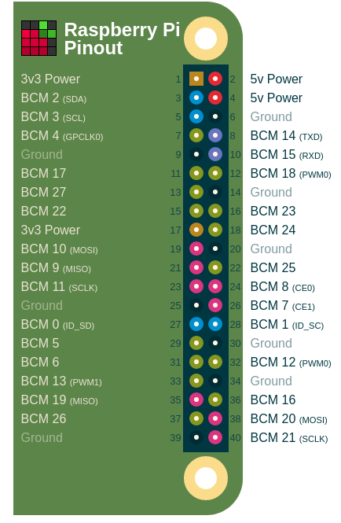
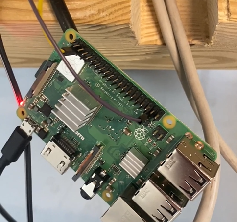
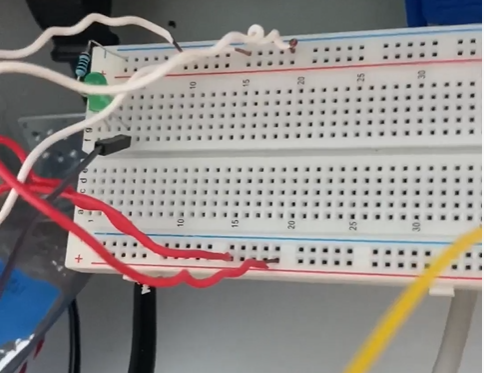

GPIO Wiring
=============

There will be 3 "sensor pis", and each will be attached to a GPIO button that will pass in signals to its pi. Repeat this process for each "sensor pi".

For reference, here is the pintout of the Raspberry Pi:

Images of the wiring can be seen below:

.. image:: ../_static/images/gpio3.png
  :width: 800
  :alt: Breadboard wiring (right)

There should be 5V out from GPIO pin 2 or 4. 
