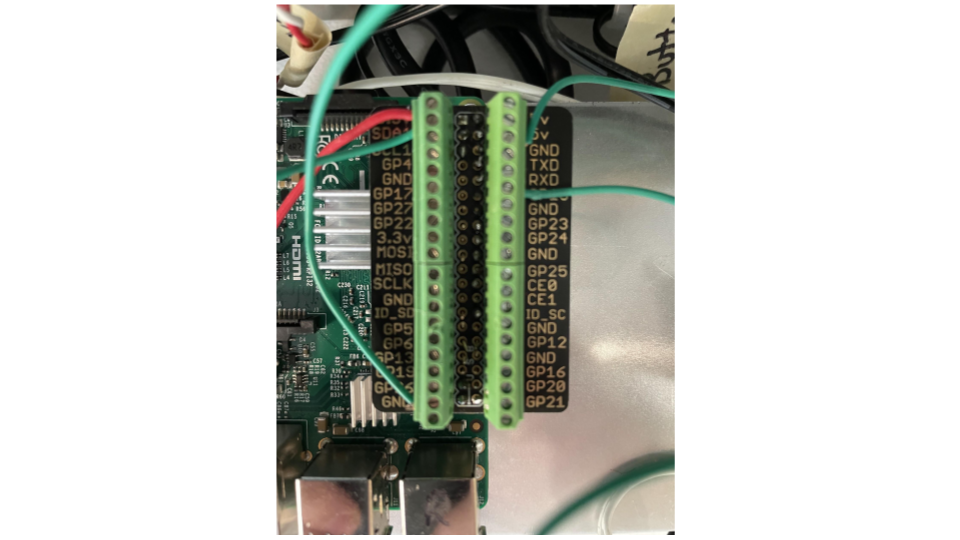

GPIO Wiring
=============

There are 3 "Sensor Pis", and each will be attached to a GPIO button that will pass in signals to its Pi, as well as an LED strip and a Voltage Level Shifter, which toggles the monitor power when the RPi boots.

Repeat this process for each "sensor pi".

For reference, here is the standard pintout of the Raspberry Pi:

.. image:: ../_static/images/raspberry_pi_pinout.png
  :width: 800
  :alt: Raspberry Pi Pinout

Images of the wiring can be seen below:

The following pinout should be followed:
  * Board Pin #1, 3v3 Power --> Level Shifter Input Wire
  * Board Pin #3, BCM2/GPIO2/SDA --> Button Input Wire
  * Board Pin #6, GND --> Level Shifter Ground Wire
  * Board Pin #12, BCM18/GPIO18/PWM0 --> LED Signal Wire
  * Board Pin #39, GND --> Button Ground Wire
