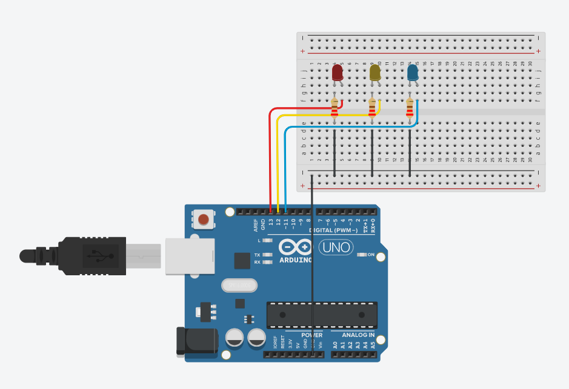

Arduino Testing
===============

Testing without Motors
######################

In the event that the full treat dispenser machine or the motors are not available, we have provided a LED sketch to test the Arduino.
This sketch is located in /motor/arduino in the elephant_vending_machine_remote repository. To upload this code to the Arduino, please see
the instructions here: :ref:`arduino_config`.

LED Wiring
##########

