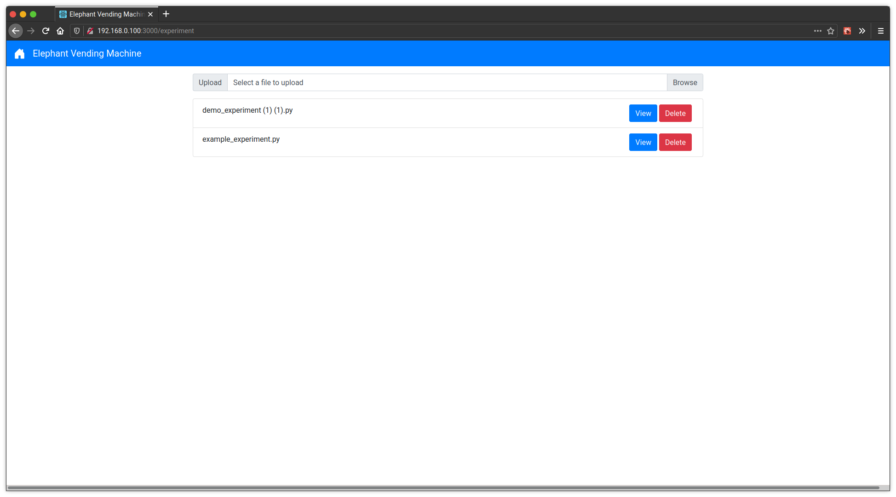
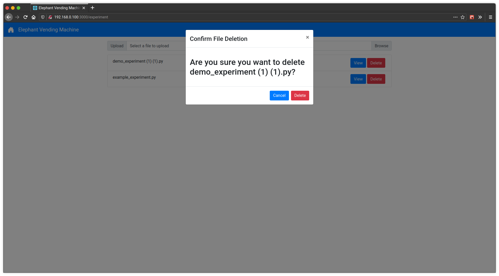
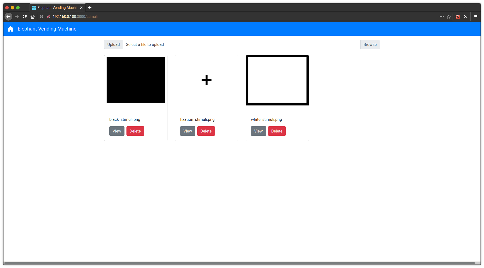

Managing Files
==============
This is the home page of the Elephant Vending Machine. This is the page you will see when you first connect.
From here you can select various pages for managing log, experiment, and stimuli files as well as for starting
experiment files.

Managing Logs
#############
From the home page, select "Manage Logs" and you will see the following log file management page.

On this log management page, you can select the "View" button for any of the log files to download that file.
You can also select "Delete" and then confirm in the popup by selecting "Delete" again to delete a log file.

Managing Experiments
####################
From the home page, select "Manage Experiments" and you will see the following experiment file management page.

On this experiment management page, you can select the "View" button for any of the experiment files to download that file.
You can also select "Delete" and then confirm in the popup by selecting "Delete" again to delete an experiment file.

In order to create a new experiment, you can either use the form to generate a standard experiment or upload a python file.
An example python file is linked at the top of the "Manage Experiments" page.

Managing Stimuli Groups
################
From the home page, select "Manage Stimuli" and you will see the following stimuli file management page.

On this stimuli management page, you can select the "View" button to open any stimuli folder. You can also select
"Delete" and then confirm in the popup by selecting "Delete" again to delete a stimuli group folder. However,
you cannot deleted the "Fixations" folder. In order to add a new group, a unique name can be entered at the top of this 
page to create a blank folder.

.. image:: ../_static/images/confirm_delete_group.png
  :width: 800
  :alt: Vending Machine Stimuli Management confirm delete popup

Managing Stimuli
################
After choosing the "View" button on a stimuli group folder, you will be navigated to a page containing all the
stimuli images in that group. 

.. image:: ../_static/images/stimuli_folder_overview.png
  :width: 800
  :alt: Vending Machine Stimuli Group Management page

You may select to "View" a specific stimuli card. You can also select "Delete" and 
then confirm in the popup by selecting "Delete" again to delete a stimuli file. 

.. image:: ../_static/images/confirm_delete__stimuli.png
  :width: 800
  :alt: Vending Machine Stimuli Management confirm delete popup

Additionally, you can "Copy to Folder" stimuli, which allows you to copy a file to another group folder.

.. image:: ../_static/images/copy_stimuli.png
  :width: 800
  :alt: Vending Machine Stimuli Management confirm delete popup